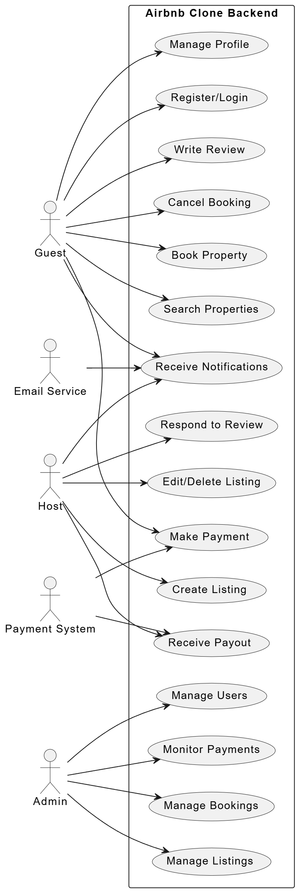

# Airbnb Clone Backend - Use Case Diagram

This directory contains the use case diagram for the Airbnb Clone Backend project. The diagram visualizes the main features and functionalities of the system, as well as the interactions between different user roles (actors) and the backend.

## Use Case Diagram

## Key Actors

- **Guest**: Registers, books properties, writes reviews, etc.
- **Host**: Manages listings, responds to reviews, receives payouts, etc.
- **Admin**: Manages users, bookings, payments, and listings.
- **Email Service**: Sends notifications.
- **Payment System**: Handles payments and payouts.

## Main Functionalities

- User registration and login
- Property search and booking
- Profile management
- Listing creation and management
- Review system
- Payment processing
- Notifications

---
